# 基于Spring的农产品销售平台 

（源代码+12000字文档+ppt）

## 项目简介

基于Spring的农产品销售平台，分为管理员、客户两个角色。 
管理员可以在平台中对用户、农产品种类以及农产品商品、订单进行管理并且可以对商品进行发货操作，还可以对公告以及客户留言进行管理。 
客户可以在平台中查看、购买、并且对农产品进行收货操作，收货成功后可以对农产品进行评价。还可以查看系统公告，并且可以给管理员进行留言。 
本系统后端使用spring+mybatis框架。数据库使用的是mysql数据库。 
该系统功能完善，界面美观，非常适合作为毕设或者课程作业以及新手开发学习。 

## 功能介绍
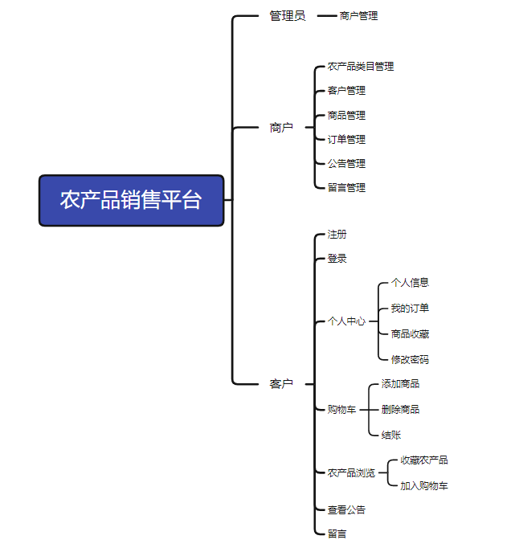 

## 技术服务

## 系统图片
#### 1.平台首页
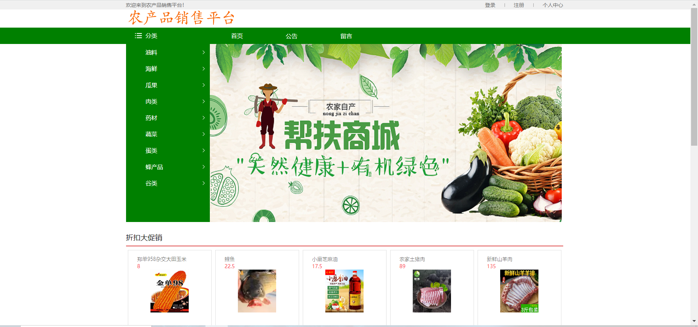 
#### 2.商品详情
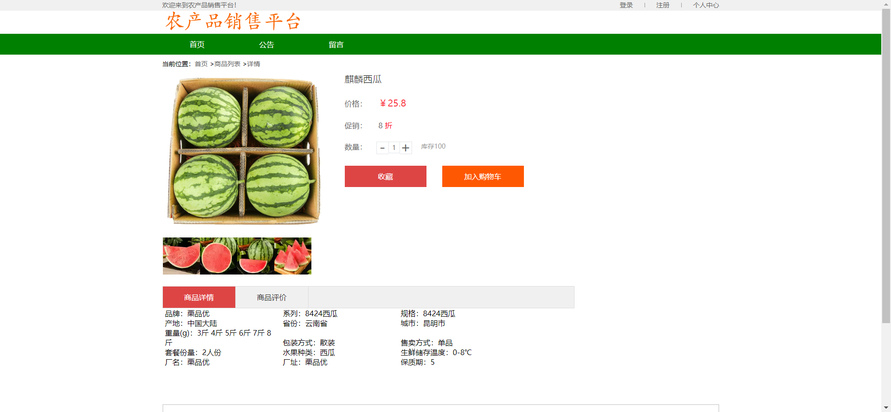 
#### 3.购物车下单
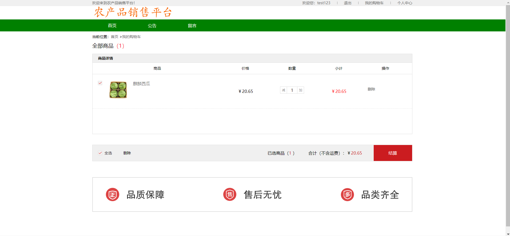 
#### 4.我的订单
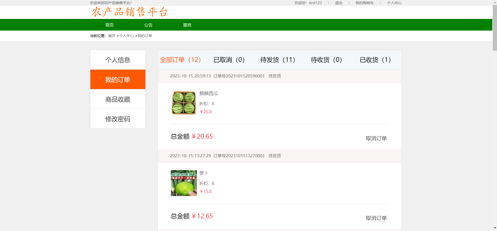 
#### 5.平台公告
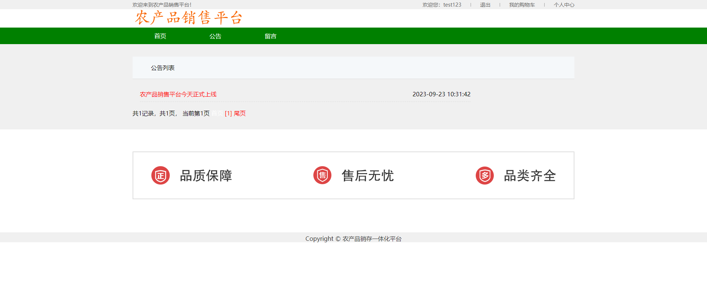 
#### 6.客户留言
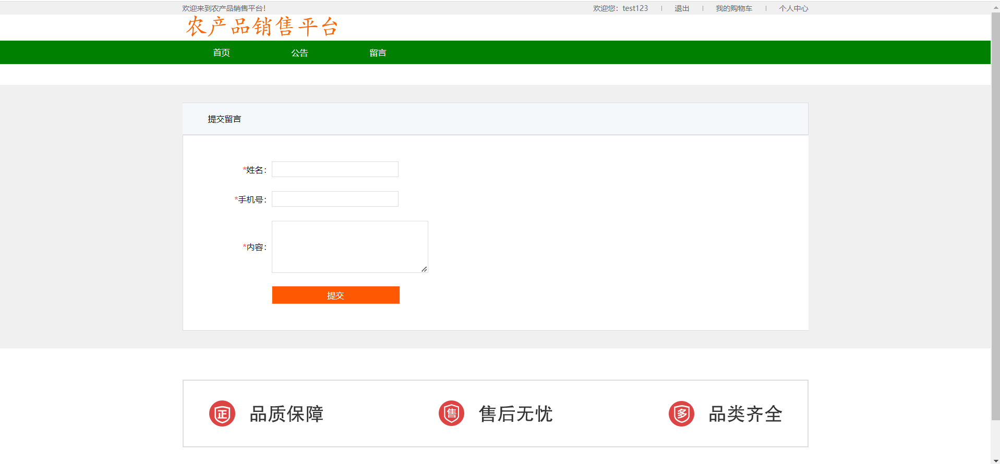 
#### 7.管理端登录页面
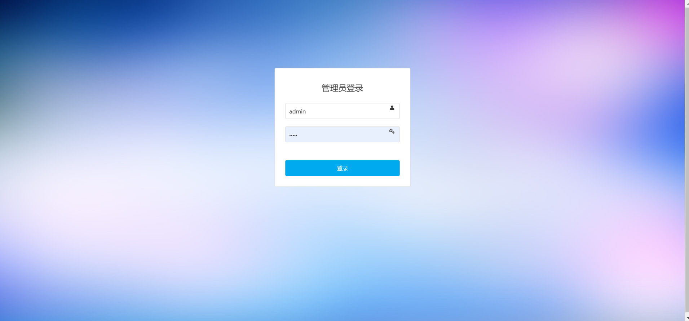 
#### 8.管理端首页
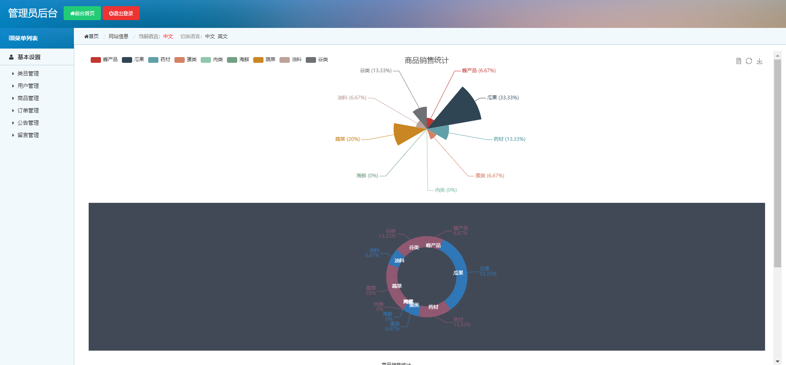 
#### 9.管理端商品管理
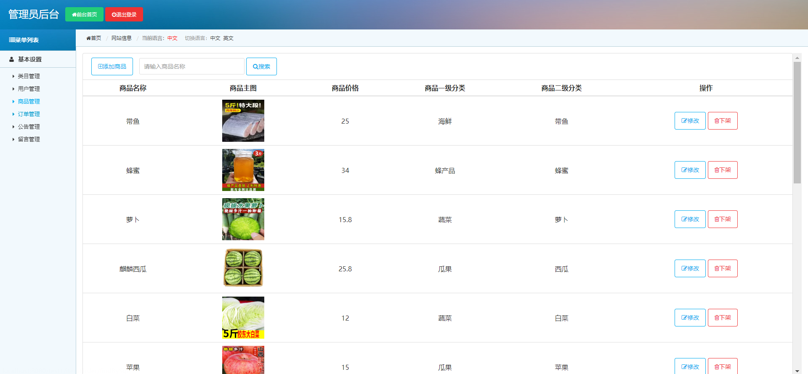 
#### 10.管理端订单管理
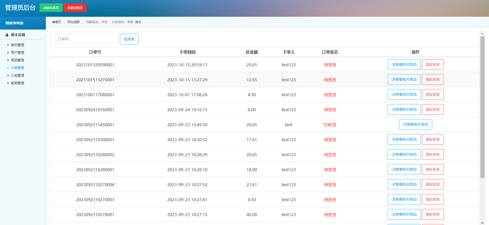 
